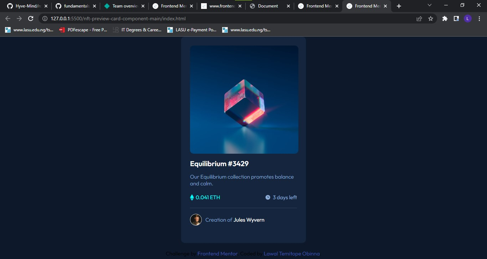

# Frontend Mentor - NFT preview card component solution

This is a solution to the [NFT preview card component challenge on Frontend Mentor](https://www.frontendmentor.io/challenges/nft-preview-card-component-SbdUL_w0U). Frontend Mentor challenges help you improve your coding skills by building realistic projects. 

## Table of contents

- [Overview](#overview)
  - [The challenge](#the-challenge)
  - [Screenshot](#screenshot)
  - [Links](#links)
- [My process](#my-process)
  - [Built with](#built-with)
  - [What I learned](#what-i-learned)
  - [Continued development](#continued-development)
  - [Useful resources](#useful-resources)
- [Author](#author)
- [Acknowledgments](#acknowledgments)

## Overview

### The challenge

Users should be able to:

- View the optimal layout depending on their device's screen size
- See hover states for interactive elements

### Screenshot


### Links

- Solution URL: [Add solution URL here](https://your-solution-url.com)
- Live Site URL: [Add live site URL here](https://your-live-site-url.com)

## My process

### Built with

- Semantic HTML5 markup
- CSS custom properties
- Flexbox
- Mobile-first workflow
- [Styled Components](https://styled-components.com/) - For styles
- [Google Fonts](https://fonts.google.com/specimen/Outfit)

### What I learned
- Transition
- Opacity
- :root
```css
  :root {
    --dark-blue-main: hsl(217, 54%, 11%);
    --dark-blue-card: hsl(216, 50%, 16%);
    --dark-blue-line: hsl(215, 32%, 27%);
    --white: hsl(0, 0%, 100%);
    --soft-blue: hsl(215, 51%, 70%);
    --cyan: hsl(178, 100%, 50%);
}
```
- positioning with relative and absolute
- ::after psuedo-selector

- how to use :hover and ::after together
```css
.img-container:hover::after {
    content: "";
    background-color: var(--cyan);
    top: 0;
    left: 0;
    right: 0;
    bottom: 0;
    border-radius: 10px;
    opacity: 0.5;
    position: absolute;
}
```
- adding images to another image 
- centering with "display flex"
```css
body {
    display: flex;
    flex-direction: column;
    justify-content: center;
    align-items: center;
    gap: 5px;
}
```
- placing stuffs at the actual center with transform:
```css
.img-container .view-container {
  transform: translate(-50%, -50%);
}
```

### Continued development

- use of [:root] - would like  to use it in future projects. Still not completely comfortable with it

## Author
- Frontend Mentor - [@yourusername](https://www.frontendmentor.io/profile/yourusername)
- Twitter - [@TopeLawal_O](https://www.twitter.com/TopeLawal_O)